# ROOMA 
# Diagrama de entidades

[Mermaid Live Editor - Diagrama de entidades](https://mermaid.live/edit#pako:eNqdWG1P4zgQ_itRpP0GK-gCB0j3wSRuydEmvbyw2hNS5Sam9ZHEPcfpwhL--42TJqRpWnaXD6W2x_bMPM-8uK96yCOqX-tUmIwsBEke0of00yftz-ZPw7ZvmcjEnmZNpmM8gTEykdcSUXsCL0Cu5WivD6mmsVRqLNKmd2qQScHShUYTwmLtQc9T9l9Oj7SUSy3N4_hBbwmtSJZ95yICud51wWMKaz62ke0XY2SbY8c1C2ROLHtLMCUJbQ2zXNQzEZFUmzMhlyZ8a9-95Gl7vKBpRIWamHO4lqRalvCnaqbeIvgji6mVkAUNRLxnZZrPYxZaUWt5yedzRrO2huGSRnlMO2fQLGM8bU2SMOR5Kj1JZJ7V9kiWUC0UFL5GSG7NxiSTBk9TGko4SC2-KbjurXsL2ybaj5dksvR1Lw4RzULBVurIHZGIg70UtGfh3v1zFsdt6_M5C0nvabV7pILtQUeGb93jYoJ849ayR4UxdjxsVqLKijyjYgamDO9AGBy4YlQSwbiSKA0fOr4zO2C9GpAVETKhqaxOausp4n0arjYo76yrE4HSdNe2mlcrLiSJSGe9VLc09CN9Q5JGTCH-ru8eM-obmx1WKqmgmWwvxrAYg8bttYZPCZFhN3LKuYqRHYgKF_-FDR-bhWXfW-q_FxgG9rxhMC4MZBt4XKFXGWvhyY37O_BsQ7-bMG6dCb5xzG-gj-1jd0NURal_OUvNilsdGqtJSAGVraV-Lh6N0UfardmawTbSsLBKeB3EqUiYpBOShVySbD8zKrlhnpCIAxZ7BR8hm8BB01IekM36yDQEaAL3QMwL-giIpz1xG9GQJSTWJKgbo0SloEOhWhJhCl5SMTpFlrkBG9AunHvsmgFueTnKexH4KaxhV0hg9B7hJg5MNLPsvwNrbNnOHphUBjrEn9pg8hu2tiyski2CKoUMy7H3KCMocOb7LKHJvGUXySUX766ohGjUFVsTCFagx4dOE5BhQecH_fT4fE_9DXmi9oFMQp6185OT7epLsxVPM9pdbtiqUmAGdaw3mMr0URnRA_cmwIYu9m5nvnOH9_mqN8wlFOZ0f7FaQymyoj0h_rxioq_2vB1qhYBXh7oh30W2hwwF-WyKRvtIGNG5tLoctPopeIh1hqN0Uel1iKxxXQ8bp0tB0oyUDUC35yEvCu8JlUse1VkY-47pHFJ7S8u6W4KDv5MXXwHRJhQREWS5pzZNWGbSR5LHbZPky0oxwnCxafkzA0FTZ-Kb-usUfZuicQOKZRuWieHjwwqx5VxJU9KZakpdl0-q-envd_pwcAAIqHCzqeuMgMAelBnPGd8DHu3-pGnrGBdMvsC-sfO1mIDFwaS4tUa3Hdj6GzoIQh6vq-lN0HgB0HDm4mngd7LMBqnpNp_WVEBb6pbpoHGOSuxuGZ3ZTgMZrNSwJkgZnTMPjwJXRcMvkER22LFBfYo87yv08WCCh_0CT4DEM8ih1tAykA8GFRBKTmD7s7K3KKc6vnqP4prhNdtAj1pxBwX-7S-oC_3jmsEbAFQcOc5ojCG8DOgjnLtiZPm3wU0H10p6q9EvXz3b_mTpUws9_6szU3XZcfegVnONAh0kTkPxsiqheLcQaA0Nd_vWOQmf8pUBT7u9T4TychSoaMP3kMR-wS10DZHlV9CNnZFlF_DpBH4B0Yt8PENT5PoqMUIIq6w0C7y65ToYTmyFogjovfUwgPsRvMS2Y0B9QPAlq94s7eJxGQY_-WItiuNj_qo1bd21ejnwjJYtWzO7kdp-PijRkKcSGr5e6Z2GVm1opDsK9AovyZxJsnN2UWidZnRL6-7J24-IjajMY6KRXrV35QXkjjlt3g0863XOpr9UGwAzyDI9yrSFFB9Vz8G19x6uXt-Id7s5tS1iKtCA9z3H98pTUH1FFkT0bGg1Z0q2ZOacfixYeaTPDR1BRRD6LHnPkdv9zhY5DpD6g96j64HNXTstSUkDcAoA0OfIXnnAK2Y_-mBtdw0HI6hVvA9FQ0dM0PKRXJGFpf_lDPIo_3jfAvIEZJkdlrV3lcG0U0Mb5VTFzZNesnUr4UHiV9VHiaxZGqrg63E86NKqCBv6PLJF3ntkO3-_310laBWi-pG-ECzSr6XI6ZGewOuQqKFeJnuwb0kTcH4ZI0Q8lQ0W7FmR9B_Ok3qb4PliqV8_kjiDUV72AptfCxuR8rcyQ_Wp-vV5eYJ-_ao_69fHZ5cXn_84vxycXl5cDM4HZ-dnR_oLzJ8Ozj9fXHw5GZyeXn25Ojv5Mng70n-U1w4-X1xeXl5cXl1dnV2eDk5Oj3QaMXgMTaofK8vfLN_-B5ft4-k)

## Código mermaid

```mermaid
erDiagram


USUARIO {
  int id PK
  string email "unique, not null"
  string password "not null"
  string role "TENANT|LANDLORD|ADMIN"
  string name
  string surname
  date birthDate
  string phone
  string gender
  boolean smoker
  string profileImageUrl
  string profileImagePublicId
  string hobbies
  string schedule
  string profession
  string accountStatus
  datetime createdAt
  datetime lastConnectionAt
}

VIVIENDA {
  int id PK
  string title "not null"
  string description "not null"
  double price "not null"
  string bills
  string ubication "not null"
  string state "ACTIVE|MATCHING|CLOSED"
  int user_id FK "propietario"
}

FOTO_VIVIENDA {
  int id PK
  int apartment_id FK
  string url "not null"
  string publicId "not null"
  int orden "not null"
  boolean portada "not null"
}

MATCH_VIVIENDA {
  int id PK
  int candidate_id FK
  int apartment_id FK
  boolean candidateInterest
  boolean landlordInterest
  datetime matchDate
  string matchStatus "ACTIVE|MATCH|REJECTED|INVITED|SUCCESSFUL|CANCELED"
}

MIEMBRO_VIVIENDA {
  int id PK
  int apartment_id FK
  int user_id FK
  string role "HOMEBODY|RENTER"
  date joinDate "not null"
  date endDate
}

REGLA_VIVIENDA {
  int id PK
  int vivienda_id FK "unique"
  boolean permiteMascotas "not null"
  boolean permiteFumadores "not null"
  boolean fiestasPermitidas "not null"
}

FACTURA {
  int id PK
  string reference "not null"
  decimal totalAmount "not null"
  string status "PENDING|PAID|CANCELLED|OVERDUE"
  date duDate "not null"
  int apartment_id FK
  int user_id FK "casero"
}

DEUDA_INQUILINO {
  int id PK
  int bill_id FK
  int user_id FK
  decimal amount "not null"
  string status "PENDING|PAID|OVERDUE"
}

VALORACION {
  int id PK
  int review_member_id FK "autor"
  int reviewed_member_id FK "valorado"
  int apartment_id FK
  int rating "1-5, not null"
  string comment "max 500"
  string response "max 500"
  boolean published "not null"
  datetime reviewDate "not null"
}

REFRESH_TOKEN {
  int id PK
  int user_id FK
  string token "not null"
  string deviceId "not null"
  date expiration "not null"
}


TRANSACCION_PAGO {
  int id PK
  int debtId FK
  int userId FK
  decimal amount
  string status "PENDING|COMPLETED|FAILED"
  datetime transactionDate
  string paymentMethod
}

METODO_PAGO {
  int id PK
  int userId FK
  string gatewayToken
  string cardMask
  boolean isDefault
  string type "CREDIT_CARD|DEBIT_CARD|PAYPAL"
}

INCIDENCIA {
  int id PK
  int apartmentId FK
  int tenantId FK
  int landlordId FK
  string title
  string description
  string status "OPEN|IN_PROGRESS|RESOLVED|CLOSED"
  string priority "LOW|MEDIUM|HIGH"
  datetime createdAt
  datetime resolvedAt
}

RESUMEN_REPUTACION {
  int userId PK
  decimal averageRating
  int totalReviews
  datetime lastUpdated
}

TOKEN_SEGURIDAD {
  int id PK
  int userId FK
  string token
  string type "PASSWORD_RESET|EMAIL_VERIFICATION|ACCOUNT_ACTIVATION"
  datetime expirationDate
  boolean used
}

OAUTH {
  int id PK
  int userId FK
  string provider "GOOGLE|FACEBOOK|GITHUB"
  string providerId
  string email
  datetime linkedAt
}

TWO_FACTOR {
  int userId PK
  string secretEncrypted
  boolean enabled
  string backupCodes
  datetime createdAt
}

AUDIT_EVENT {
  int id PK
  int userId FK
  string eventType "LOGIN|LOGOUT|CREATE_APARTMENT|DELETE_USER"
  string description
  string ipAddress
  string userAgent
  datetime timestamp
}


USUARIO ||--o{ VIVIENDA : "posee"
VIVIENDA ||--o{ FOTO_VIVIENDA : "contiene"
VIVIENDA ||--o{ MIEMBRO_VIVIENDA : "tiene"
USUARIO ||--o{ MIEMBRO_VIVIENDA : "habita"
VIVIENDA ||--|| REGLA_VIVIENDA : "posee"
USUARIO ||--o{ MATCH_VIVIENDA : "postula a"
VIVIENDA ||--o{ MATCH_VIVIENDA : "recibe candidatos"
VIVIENDA ||--o{ FACTURA : "genera"
USUARIO ||--o{ FACTURA : "crea como casero"
FACTURA ||--o{ DEUDA_INQUILINO : "divide en"
USUARIO ||--o{ DEUDA_INQUILINO : "debe pagar"
USUARIO ||--o{ VALORACION : "escribe"
USUARIO ||--o{ VALORACION : "recibe"
VIVIENDA ||--o{ VALORACION : "contexto"
USUARIO ||--o{ REFRESH_TOKEN : "tiene"


DEUDA_INQUILINO ||--o{ TRANSACCION_PAGO : "paga con"
USUARIO ||--o{ TRANSACCION_PAGO : "realiza"
USUARIO ||--o{ METODO_PAGO : "posee"
VIVIENDA ||--o{ INCIDENCIA : "tiene"
USUARIO ||--o{ INCIDENCIA : "reporta como inquilino"
USUARIO ||--o{ INCIDENCIA : "gestiona como casero"
USUARIO ||--|| RESUMEN_REPUTACION : "tiene resumen"
USUARIO ||--o{ TOKEN_SEGURIDAD : "genera"
USUARIO ||--o{ OAUTH : "vincula con"
USUARIO ||--|| TWO_FACTOR : "configura"
USUARIO ||--o{ AUDIT_EVENT : "genera eventos"

```

