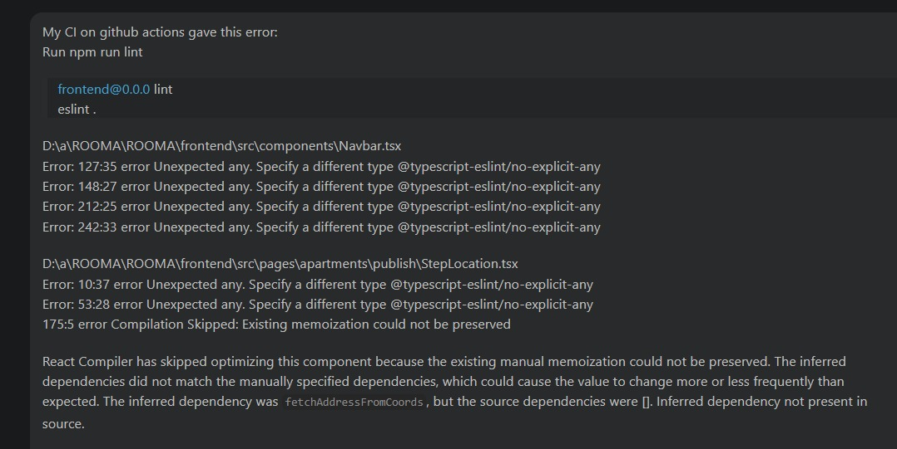
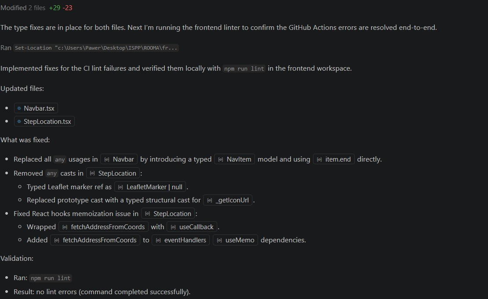
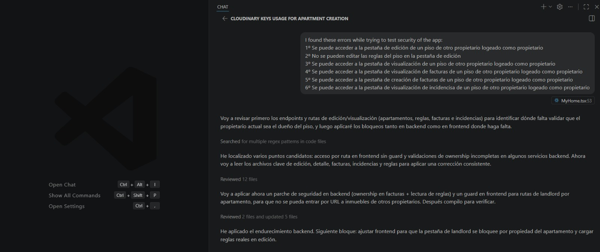
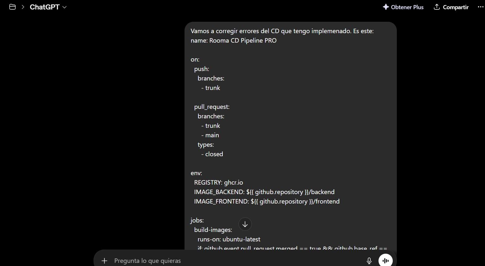
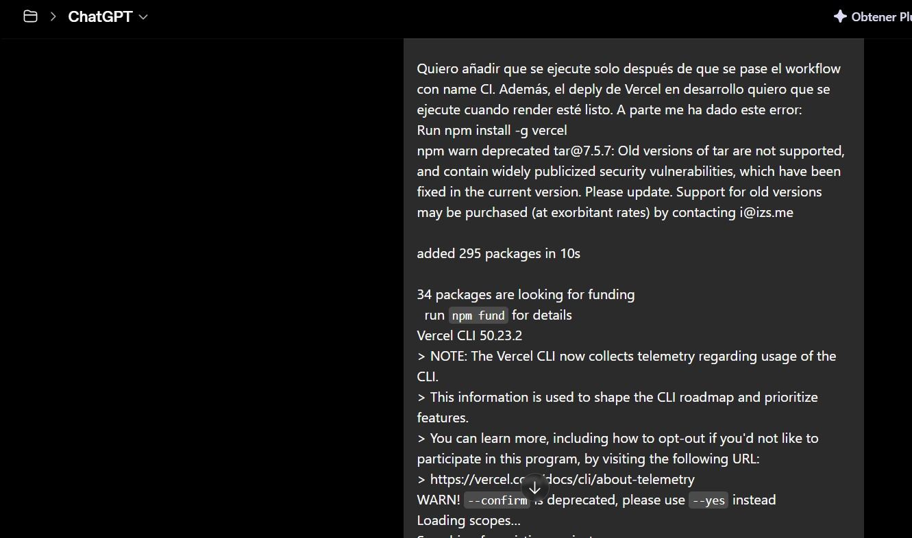
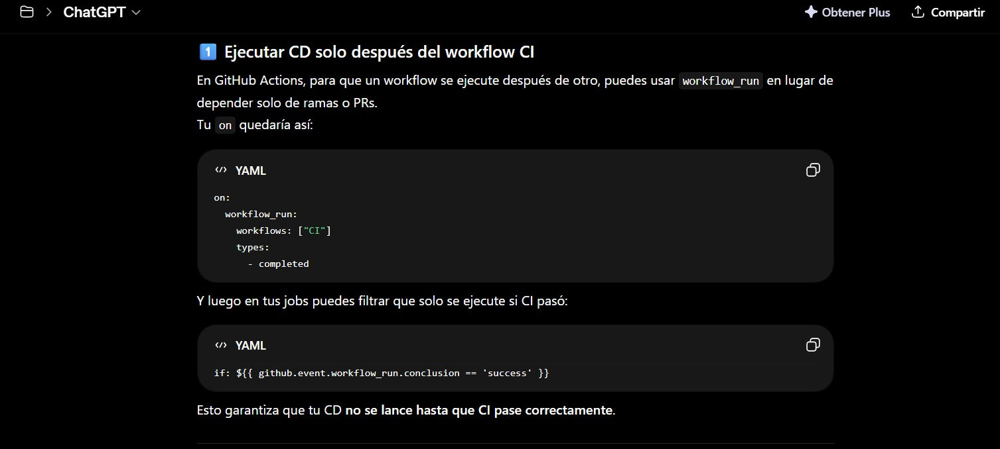

# INFORME DE JUSTIFICACIÓN ESTRATÉGICA Y OPERATIVA: INTEGRACIÓN DE LA IA EN EL PROYECTO

## 1. Introducción y Propósito
El presente documento tiene como objetivo detallar el uso estratégico de la IA durante el ciclo de vida de nuestro proyecto. La integración de estas herramientas no ha sido accidental, sino una decisión orientada a la optimización de recursos, la reducción de la deuda técnica y la aceleración del *time-to-market*. Mediante el uso de modelos avanzados, el equipo ha podido delegar tareas mecánicas y centrar su capacidad intelectual en la arquitectura lógica y la resolución de problemas de alto nivel.

---

## 2. Ingeniería de Software y Desarrollo Técnico
La IA ha actuado como un multiplicador de fuerza en el desarrollo, facilitando una colaboración más fluida entre los miembros del equipo:

### 2.1 Desarrollo Frontend y Experiencia de Usuario (UX/UI)
*   **Generación y Estilizado:** Se han utilizado herramientas para la creación de componentes dinámicos y la aplicación de estilos CSS complejos, asegurando una interfaz moderna y funcional (**Dani, Juan, Jesús, Iván**).
    * **Ejemplo**: "_Necesito crear un componente de tarjeta (Card) dinámico en React para mostrar las incidencias del proyecto. La tarjeta debe incluir un badge de prioridad que cambie de color según el estado (crítico, medio, bajo) y un efecto de hover suave que eleve la tarjeta y cambie el borde. Utiliza CSS modular o Tailwind para asegurar un diseño minimalista y moderno, y asegúrate de que el componente sea totalmente responsive._" 
        Se adjunta enlace a una conversacion real que se utilizó para generar una primera version del componente para las Card: https://gemini.google.com/share/ce0179872689
      
*   **Cohesión Visual:** La IA ha sido clave para garantizar que el diseño sea consistente en todas las pantallas, detectando discrepancias visuales y sugiriendo ajustes de diseño (**Javier Clavijo, Iván**).
    * **Ejemplo**: "_Tengo este archivo CSS que define los estilos globales de mi aplicación y este nuevo componente que acabo de crear. Analiza ambos y dime si el nuevo componente mantiene la cohesión visual del proyecto, específicamente en el uso de las variables de color y sombras, así como el radio de los bordes y los espaciados internos._" 
        En primer lugar se pasó una primera version del css de la aplicacion a Gemini para detectar inconsistencias y puntos débiles: https://gemini.google.com/share/2398d83e75d6 
      
*   **Calidad del Código (Linting):** Se han corregido errores de sintaxis y formato mediante el análisis automático del linter, asegurando un código limpio y mantenible (**Guille**).
    * **Ejemplo**: *"He pasado el linter a mi proyecto de frontend y me devuelve varios errores de formato y sintaxis en estos archivos. Por favor:*

        * *Corrige las inconsistencias en el uso de comillas y puntos y coma.*

        * *Organiza los 'imports' alfabéticamente y elimina los que no se estén usando.*

        * *Refactoriza los fragmentos donde el linter indica que la complejidad ciclomática es demasiado alta para que el código sea más legible.*

        * *Asegúrate de que el resultado final cumpla estrictamente con las reglas de estilo de nuestra guía de Clean Code."*
     
          
          

       
### 2.2 Arquitectura Backend y Lógica de Negocio
*   **Generación de Código y Vibe Coding:** Mediante **GitHub Copilot** y su "modo agente", se han transformado requisitos textuales en planes de diseño técnicos ejecutados bajo supervisión humana. Esto ha permitido crear aplicaciones completas para métricas de forma iterativa (**Marco, David, Manuel**).
    * **Ejemplo**: *"Basándote en el archivo de especificaciones que tengo abierto, genera un plan técnico para crear un módulo completo de visualización de métricas. El proceso debe ser el                             siguiente:*

        * *Diseña la arquitectura de los servicios de cálculo y las vistas del frontend.*

        * *Tras mi validación del plan, implementa de forma iterativa las funciones de procesamiento de datos y los componentes de las gráficas.*

        * *Refactoriza cada módulo para asegurar que el código sea altamente cohesivo y desacoplado.*

        * *Al terminar cada fase, verifica que la implementación cumple con los requisitos técnicos definidos en el documento base."* 
          En este caso se adjunta un archivo de texto en la que se detalla completamente el proceso para añadir métricas a la aplicacion de rendimiento: 
          
*   **Comunicación e Infraestructura:** Optimización de la capa de servicios para la comunicación entre el front y el back, además de la creación de archivos de configuración críticos como Dockerfiles para compilación nativa en Java (**Juan, Manuel**).
    * **Ejemplo**: *"Necesito resolver los problemas de latencia en la comunicación entre el frontend y el backend. Para ello:*

        * *Crea un archivo Dockerfile para mi aplicación Java, configurando una compilación nativa que reduzca el tiempo de arranque y el consumo de memoria en producción.*

        * *Configura los parámetros necesarios para que el contenedor pueda comunicarse correctamente con el servicio de base de datos en un entorno de staging.*

        * *Asegúrate de que la configuración sea escalable y siga las mejores prácticas de infraestructura como código."* 
          Se adjunta una conversación con Gemini donde se crea la base para el archivo Dockerfile de nuestra aplicacion: https://gemini.google.com/share/bec85d0603da
          
*   **Seguridad:** Revisión asistida de rutas y endpoints para garantizar que la lógica de acceso sea segura y cumpla con los estándares de protección de datos (**Guille**).
    * **Ejemplo**: *"Actúa como un experto en ciberseguridad y seguridad en APIs. Analiza las siguientes rutas de mi controlador en el backend y verifica si existen vulnerabilidades. En concreto:*

        * *Comprueba si los endpoints sensibles tienen aplicados los filtros de autenticación y autorización adecuados.*

        * *Valida que no existan riesgos de Inyección SQL en los parámetros de búsqueda.*

        * *Revisa que la lógica de acceso no permita que un usuario autenticado pueda consultar datos de otros usuarios.*

        * *Sugiere las correcciones necesarias para garantizar la protección de los datos de los usuarios."* 
          

---

## 3. Calidad de Software, Testing y CI/CD
La IA ha redefinido nuestro flujo de QA (Quality Assurance), permitiendo un enfoque proactivo en lugar de reactivo:

*   **Generación de Casos de Prueba:** Creación de planes de pruebas completos que incluyen tanto casos positivos como negativos, asegurando que el sistema sea resiliente ante entradas inesperadas o errores de usuario (**Dani, Germán, Manuel, Guille**).
    * **Ejemplo**: *"Basándote en el código de este controlador de registro de usuarios, genera un plan de pruebas exhaustivo que incluya:*

         * *Casos Positivos: Verificación de flujos correctos con datos válidos y formatos de correo esperados.*

         * *Casos Negativos: Pruebas de resistencia ante entradas nulas, correos duplicados, contraseñas excesivamente cortas y caracteres especiales no permitidos.*

         * *Edge Cases: Comportamiento del sistema ante el límite máximo de caracteres en los campos de texto."* 
           Se adjunta la conversación con Gemini que ayudó a generar un plan de pruebas para la lógica de registro: https://gemini.google.com/share/88e62dc6ace5

*   **Automatización E2E:** Identificación de localizadores de la UI para tests de extremo a extremo (End-to-End) y análisis de cobertura de código para detectar zonas críticas no testeadas (**Dani, Sergio**).
    * **Ejemplo**: *"Actúa como un experto en automatización con Playwright. Necesito generar los scripts de prueba para el flujo de 'Match'. Por favor:*

        * *Genera el script de la prueba que cubra todo el flujo desde el home page hasta la confirmación de match.*

        * *Tras ejecutar los tests, analiza el reporte de cobertura de código e identifica qué funciones de la lógica de match han quedado sin testear.*

        * *Sugiere nuevos casos de prueba para cubrir esas zonas críticas y asegurar que ninguna lógica de negocio se quede sin validación automática."* 
          Se adjuta una conversación con ChatGPT que se utilizó como apoyo para los test E2E: https://chatgpt.com/share/6a044efb-b998-838e-bde0-055a386ab9bf
          
*   **Soporte en CI/CD:** Análisis y diagnóstico rápido de errores en los flujos de integración y despliegue continuo (GitHub Actions/Workflows), reduciendo drásticamente el tiempo de inactividad por fallos en el pipeline (**Guille**).
    * **Ejemplo**: *"Actúa como un experto en DevOps y automatización. He recibido un error de tipo 'exit code 1' en el paso de despliegue de mi flujo de GitHub Actions. Te adjunto los logs del fallo y el archivo YAML de configuración del workflow. Por favor:*

        * *Analiza los logs para identificar si el error se debe a una dependencia faltante, un fallo en la conexión con el servidor o una configuración incorrecta de las variables de entorno.*

        * *Explica la causa raíz del problema de forma clara.*

        * *Propón la corrección necesaria en el archivo YAML o en el script de despliegue para solucionar el fallo y evitar que el pipeline se detenga en futuras ejecuciones."* 
          
          
          

---

## 4. Análisis Estratégico, Económico y de Negocio
Más allá del código, la IA ha servido como un consultor de negocio de alto nivel:

*   **Modelado Financiero:** Generación de estimaciones de crecimiento de usuarios, cálculos de viabilidad económica y diseño de estructuras de precios competitivas (suscripciones, add-ons y tarifas por uso) (**Fran, Manuel**).
    * **Ejemplo**: *"Basándote en el documento de Análisis Económico que te he proporcionado, realiza las siguientes tareas:*

        * *Genera una estimación de crecimiento de usuarios a 12 meses proyectando un escenario conservador y uno optimista.*

        * *Calcula el punto de equilibrio (break-even point) para determinar en qué mes el proyecto será rentable."* 
           Se adjunta una conversación con Gemini en la que se pide asesoramiento sobre el analisis económico: https://gemini.google.com/share/60bd8e6dd292
          
*   **Evaluación Tecnológica:** Comparativa de proveedores de pago y valoración de stacks tecnológicos basándose en la curva de aprendizaje del equipo y la escalabilidad del proyecto (**Manuel**).
    * **Ejemplo**: *"Necesitamos elegir una pasarela de pago para nuestro proyecto y definir si el stack actual es el adecuado para escalar. Realiza lo siguiente:*

        * *Compara Stripe, PayPal y Adyen en términos de comisiones por transacción, facilidad de integración de su API y soporte para pagos recurrentes.*

        * *Evalúa nuestro stack tecnológico actual basándote en que el equipo tiene experiencia previa en Java y React, pero solo 3 meses para el lanzamiento; ¿es la curva de aprendizaje asumible o deberíamos simplificar alguna tecnología?*

        * *Analiza si esta arquitectura podrá soportar un incremento de carga de hasta 10.000 usuarios activos mensuales sin necesidad de una reescritura completa."*

*   **Toma de Decisiones:** Asesoramiento técnico para elegir entre diferentes soluciones de programación basándose en las mejores prácticas de la industria (**Iván, Javi Clavijo**).
    * **Ejemplo**: *"Estamos debatiendo si implementar la lógica de chats mediante WebSockets o utilizando Server-Sent Events (SSE). Necesito que:*

        * *Compares ambas tecnologías en términos de consumo de recursos del servidor y facilidad de implementación en un entorno Java Spring Boot.*

        * *Evalúes cuál de las dos soluciones es más resiliente ante micro-cortes de red y reconexiones automáticas.*

        * *Analices cuál es la práctica estándar en la industria para aplicaciones con una carga moderada de usuarios."* 
          Se adjunta una conversación con Gemini en la que se pide consejo sobre la tecnología a utilizar para la logica de Chats: https://gemini.google.com/share/c8281df4be75

---

## 5. Operativa, Comunicación y Activos Visuales
El flujo de trabajo diario se ha visto beneficiado por la optimización de tareas de soporte:

*   **Generación de Activos:** Creación de recursos gráficos, iconos e imágenes personalizadas para presentaciones de alto impacto mediante el uso de Nano Banana Pro y otros motores generativos (**Fran, Rafa, Dani, Ivan**).
    * **Ejemplo**: *"Genera un pack de 6 iconos vectoriales de estilo  y colores corporativos (azul turquesa #00CED1, gris oscuro #333333 y blanco). Los iconos deben representar los siguientes conceptos para una presentación de negocio: 'Análisis de Datos', 'Crecimiento Exponencial', 'Sistema de Chat', 'Gestión de Incidencias' y 'Descubrimiento de Pisos'. Todos los iconos deben tener una estética minimalista, bordes suaves y un fondo transparente para integrarse perfectamente en diapositivas profesionales."*
    * **Ejemplo 2**: Del prompt anterior obtuvimos los primeros emojis, una vez ya teníamos un estilo que nos gustaba hicimos lo siguiente:
        * Primero abrimos una conversación nueva con gemini donde le pegamos los emojis con el estilo que queremos y usamos el siguiente prompt "Analiza el estilo de este emoji y dame un json en el que se defina el estilo de un solo eomji que tenga esos colores y solo necesite la frase que quiero representar". Conversación con gemini: <https://g.co/gemini/share/1af2e3ff2f4c>  
        * En segundo lugar abrimos otra conversación donde activamos el modo nanobanana Pro y pegamos directamente el JSON obtenido. Conversación con gemini: <https://g.co/gemini/share/3b8b36bd227c>
      
*   **Gestión del Conocimiento:** Conversión de documentación técnica a formato Markdown, redacción de informes profesionales y corrección de inconsistencias semánticas en la documentación del proyecto (**Rafa, Fran, Dani, Iván, Manuel**).
    * **Ejemplo**: *"Tengo este informe técnico sobre la arquitectura del sistema redactado de forma rápida y desestructurada. Por favor, procésalo siguiendo estos puntos:*

        * *Convierte todo el contenido a formato Markdown, utilizando una jerarquía de encabezados clara y tablas para los parámetros técnicos.*

        * *Elimina redundancias y asegura que la terminología técnica sea precisa y consistente en todo el documento.*

        * *Identifica y corrige cualquier inconsistencia semántica."* 
         Se adjunta una conversación con Gemini en la que se pide la conversión de un texto a formato Markdown: https://gemini.google.com/share/c34cef20d995
          
*   **Ideación Estructural:** Uso de la IA como espejo para desafiar estructuras de presentaciones y proponer ideas disruptivas en la fase de concepción (**Rafa**).
    * **Ejemplo**: "Actúa como un Consultor de Estrategia de alto nivel. Tengo esta estructura inicial para la presentación de nuestro modelo de negocio ante inversores (adjunto esquema). Antes de empezar con el diseño, necesito que:

        * *Cuestiones mi narrativa: ¿Dónde están los puntos más débiles de mi argumento? ¿Qué suposiciones estoy dando por sentado que un inversor podría rebatir?*

        * *Tu objetivo no es validar mi idea, sino ser mi espejo y forzarme a reconstruir la estructura de la presentación para que sea lógica y estratégicamente impecable."*

*  **Gestión del Bienestar y Dinámicas de Equipo**: Implementación de metodologías ágiles para el seguimiento del estado anímico del grupo, utilizando la IA para la formación en conceptos de gestión de RR.HH. y la creación de herramientas de seguimiento personalizadas (**Javier Lozano**).
   * **Ejemplo**: *"Actúa como un Agile Coach experto. Explícame el concepto de 'Niko-Niko Calendar' aplicado a equipos de alto rendimiento y genera una plantilla de seguimiento para un equipo de                      16 miembros. La plantilla no debe estar rellena y debe sustituir los días del calendario por 'Eventos' (del 1 al 10), permitiendo evaluar la moral del equipo tras cada hito                         crítico del proyecto. Asegúrate de que el formato sea limpio y fácil de integrar en nuestra documentación de gestión."* 
                       Se adjunta la conversación con ChatGPT que refleja todo este proceso: https://chatgpt.com/share/6a024e1c-e87c-83eb-bb9a-615359163edf
---

## 6. Supervisión Humana y Conclusión
Es importante subrayar que el uso de la Inteligencia Artificial ha estado siempre bajo la estricta supervisión de los integrantes del equipo. Cada fragmento de código, cada cálculo económico y cada diseño generado ha sido validado, corregido y adaptado por los responsables de cada área.

En conclusión, la integración de la IA ha permitido:
1.  **Eliminar el trabajo repetitivo**, permitiendo que el equipo se enfoque en la innovación.
2.  **Aumentar la robustez del sistema** mediante una detección temprana de errores y vulnerabilidades.
3.  **Garantizar una cohesión técnica y estética** difícil de alcanzar de forma puramente manual en los plazos establecidos.
